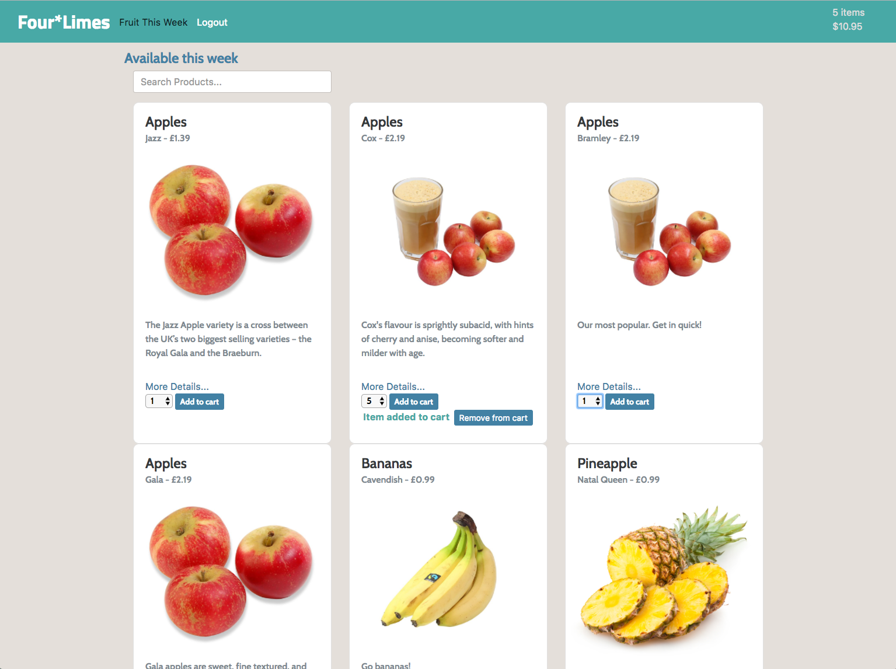
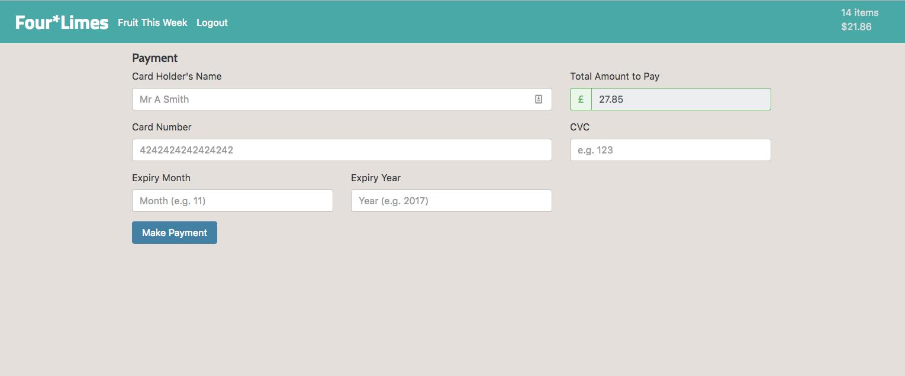
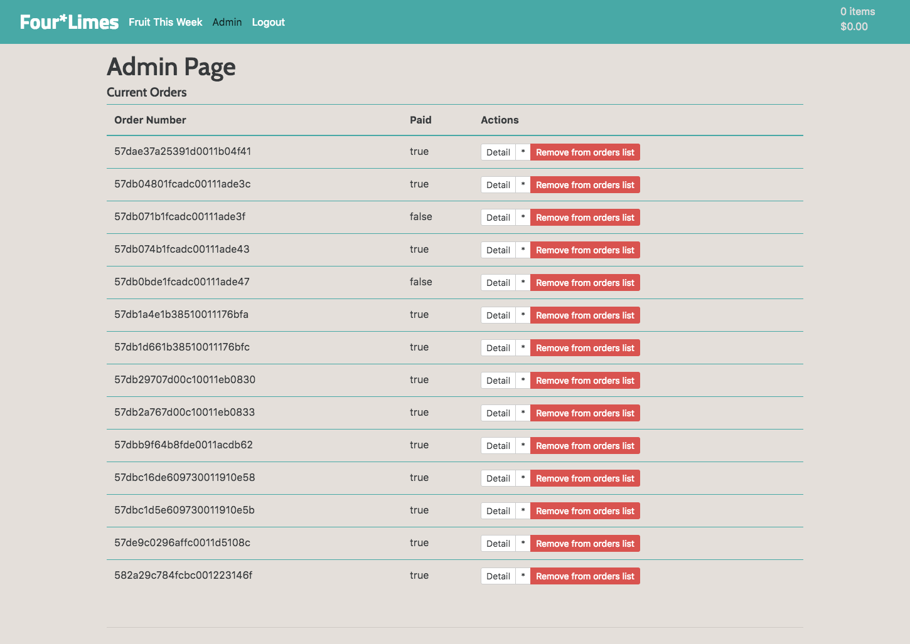
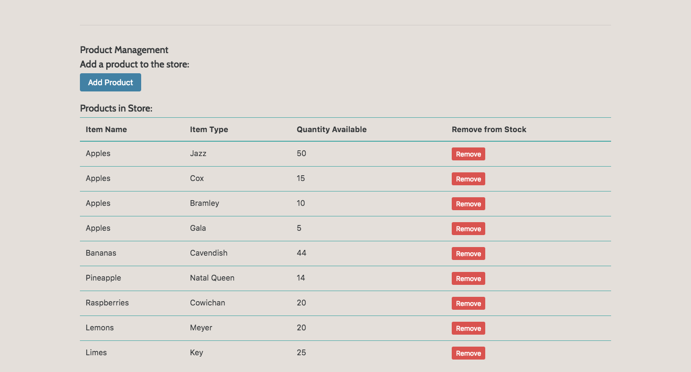
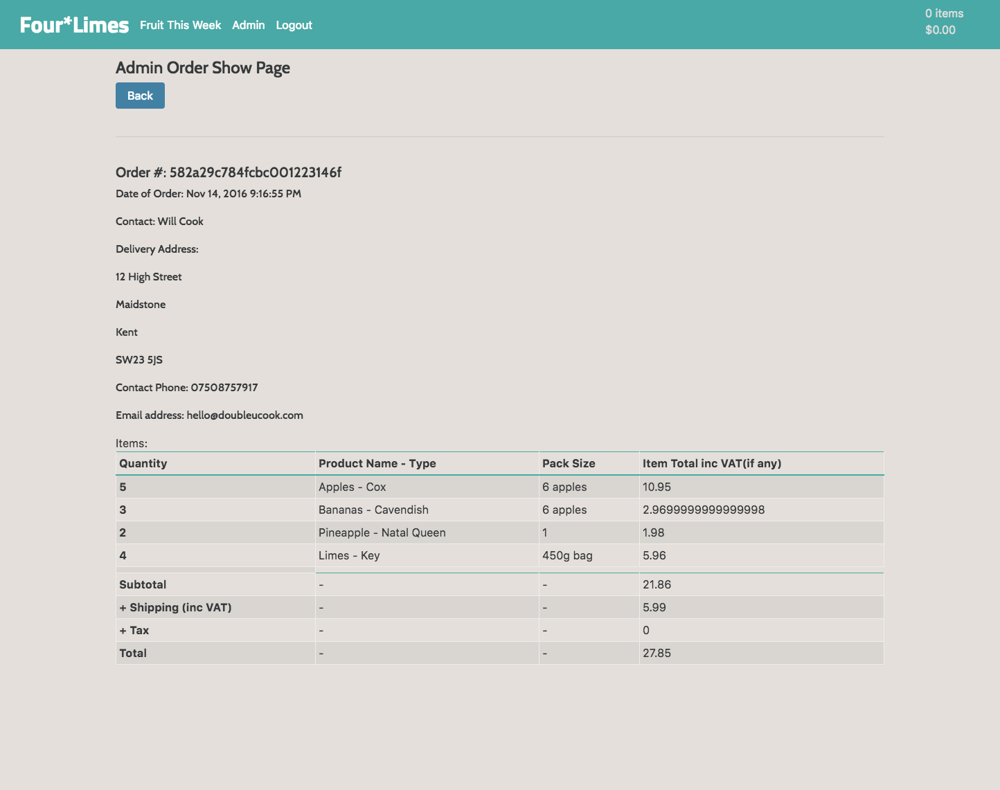

# Four\*Limes
Four\*Limes was an individual project that was completed in a week. The site was built to practice the skills learnt during the General Assembly Web Development Immersive in London, UK. Project 4 - Angular App.

### [Try the site here...](http:fourlimes.herokuapp.com/).

#### The site was developed by:

**Will Cook**, see my GitHub [here](http://github.com/willcook4).
**See more of my work [here](http://doubleucook.com).** 

## What is Four*Limes?

Built from scratch the idea of this project was to explore an ecommerce platform. Taking inspiration from existing fruit and vege delivery sites I set about over a week to develop, deploy and present a working copycat site. Integrating payment options with Stripe, building out a back end for stock and delivery management as well as UX/UI design for the store. Working along designed paths for planned user journeys. Adding in basic HTML email sending for order confirmation I explored automation of some tasks. Working to a tight deadline and on my own this was a project that I learnt alot from and hope to further develop as I experiment with future technology.

#### The following technology was used:

* Node
* Stripe API
* Nodemailer - Gmail, HTML email integration
* JavaScript
* CSS
* HTML5
* Heroku
* MacDown
* Adobe XD Mockup - Wireframes
* Cyberduck - AWS
* Devise - Authentication
* Bootstrap v4
* Amazon Web Services - S3
* ng-cart

### Screenshots

#### Main product page...

#### Payment - Stripe Integration

#### Admin - Back of house order management

#### Admin - Stock Management

#### Admin - Invoice Creation, also sent to client as an email

### Things to improve:

* Migrate the heroku deployment to Europe Region to stop Gmail from auto locking the email account due to false positive fraud prevention.
* HTML emails via templates to get more contact. e.g. confirmation of sign-up, password changes.
* Update the JavaScript to ES6 (ECMAScript 6).
* Offer an update to the ng-cart GitHub repo for currency symbol selection.  
